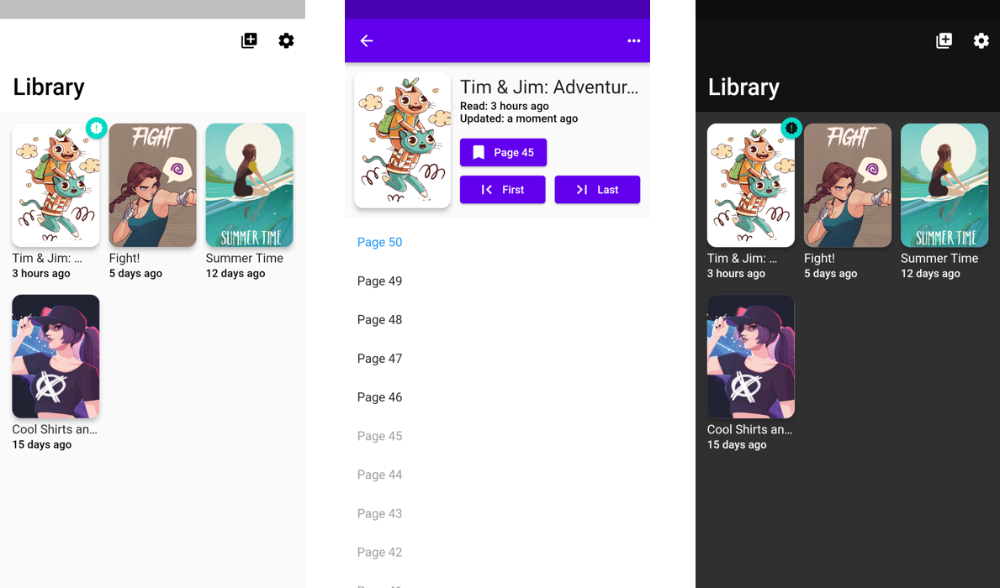

# ComicWrap F

An open source webcomic reader and tracker for Android and iOS.

It is intended for reading webcomics that are published on their own websites, and keep track of read pages and new updates.

This app is not intended to scrape comic websites. Instead, comics are read directly on the website like a normal web browser. This ensures that the app does not have a negative effect on things such as ad revenue for the webcomic creator.

## Main Features
- Read tracking (remembers the page you're up to)
- Update tracking (shows any new pages since it was added to your Library)
- In-site reading and tracking (navigate within the website and automatically track last read page)
- Android/iOS realtime sync

iOS / iPadOS [TestFlight](https://testflight.apple.com/join/eHMvo9OT)

# Building and Running

There are a few parts to the whole system:

- A Flutter App (for Android or iOS)
- Firebase project for the Database, Functions and Auth (required for the Flutter App to operate properly)
- A Node.js service for scraping comic websites (which runs on Google App Engine)

## Prerequisites

- Firebase project created (for development - can use free tier with [emulators](https://firebase.google.com/docs/emulator-suite) for functions)
- Flutter App
  - [Flutter SDK](https://flutter.dev/docs/get-started/install)
  - [Android Studio](https://developer.android.com/studio/install) (or [VS Code with dev tools](https://flutter.dev/docs/development/tools/vs-code))
  - (for iOS dev) macOS with XCode
- Node.js (project folders contain `.nvmrc` for version)

## Setup

### Firebase Functions/Emulators

To run the Firebase emulators with test data, cd into the `functions` directory.

- run `npm install` and `npm run build` first if you haven't
- run `npm run serve-all`

The test user can be logged in with email: `test@test.com` and pass: `test1234`.

### Comic Scraping Service

To run the comic scraping service, cd into the `service_scrape-comic` directory.

- run `npm install` and `npm run build` first if you haven't
- run `npm run start-local`

### Flutter

- Create a Firebase project
  - (Android) download and copy `google-services.json` to `android/app/`
  - (iOS) download and copy `GoogleService-Info.plist` to `ios/`

- (from project root) run `flutter pub get` to get dependencies
- run `flutter pub run build_runner build` to generate code (will sometimes need to run this again after editing certain files)

You should now be ready for development! There are a few run configurations for Android Studio in `.run/`, and run configurations for VS Code in `.vscode/launch.json`.

# Contributing

At this stage there's no real contributing guidelines besides "be nice, use common sense".

Feel free to [create an Issue](https://github.com/jackv24/ComicWrap-F/issues/new/choose) with any bugs, features requests, etc!

## Localisation

All in-app text strings are link to a [POEditor project](https://poeditor.com/join/project?hash=ZXq5B7LDqL).
